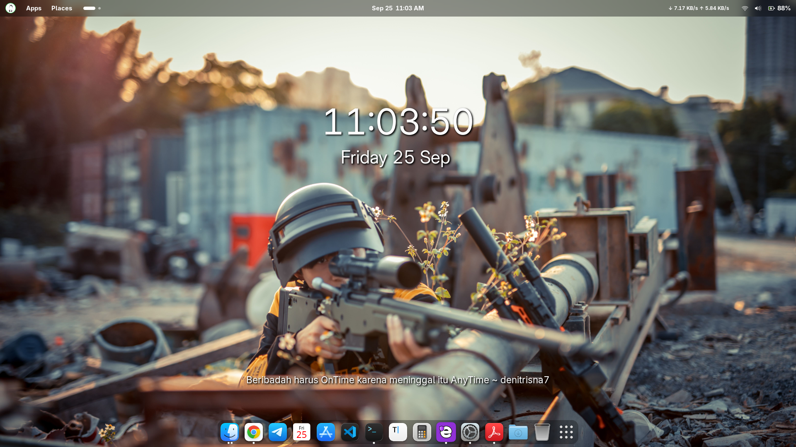
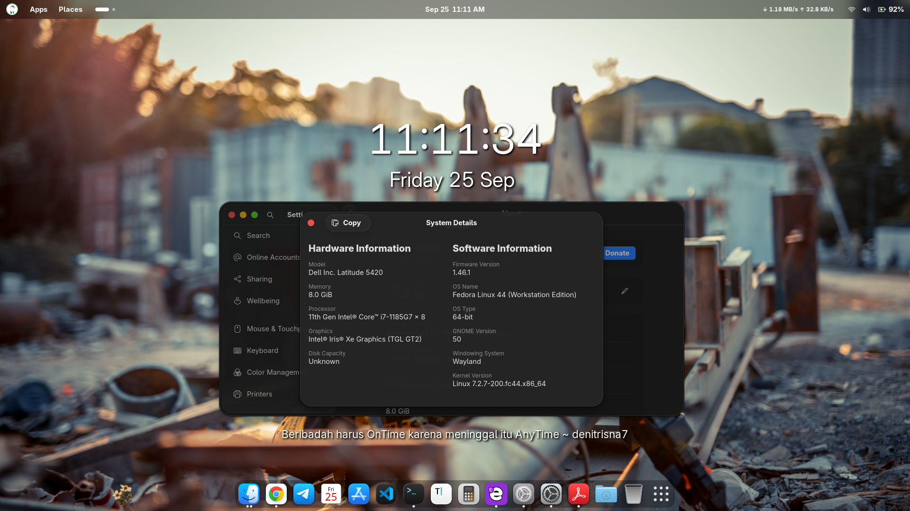
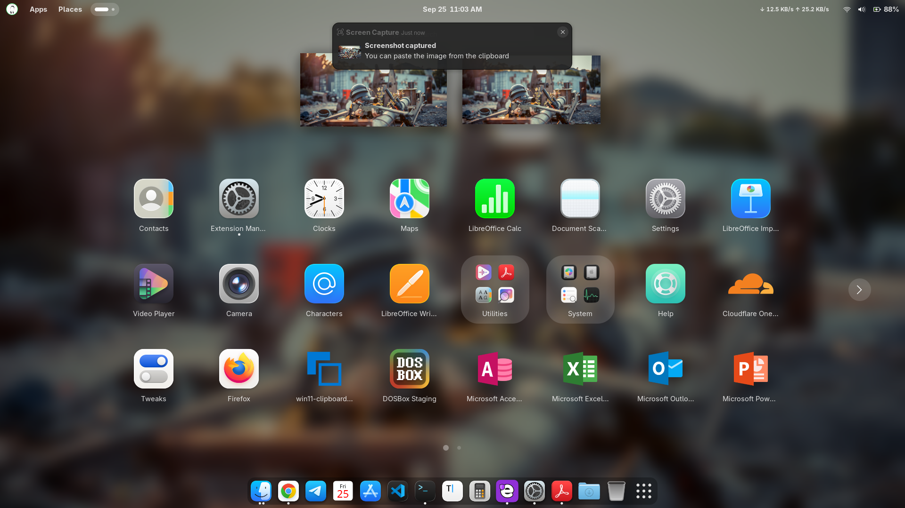
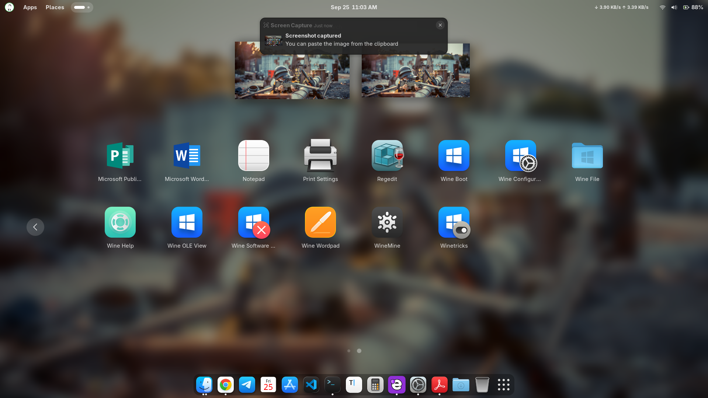
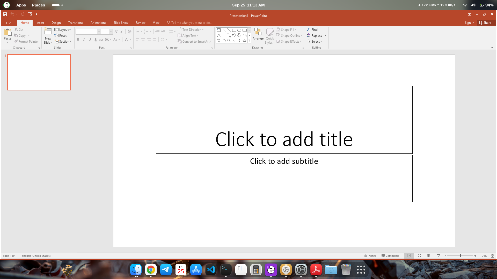
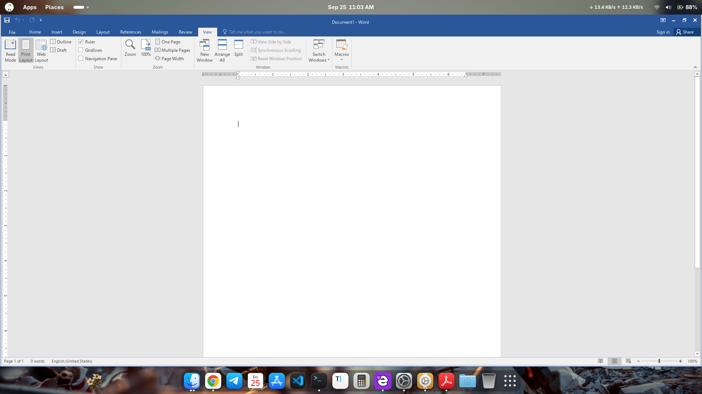
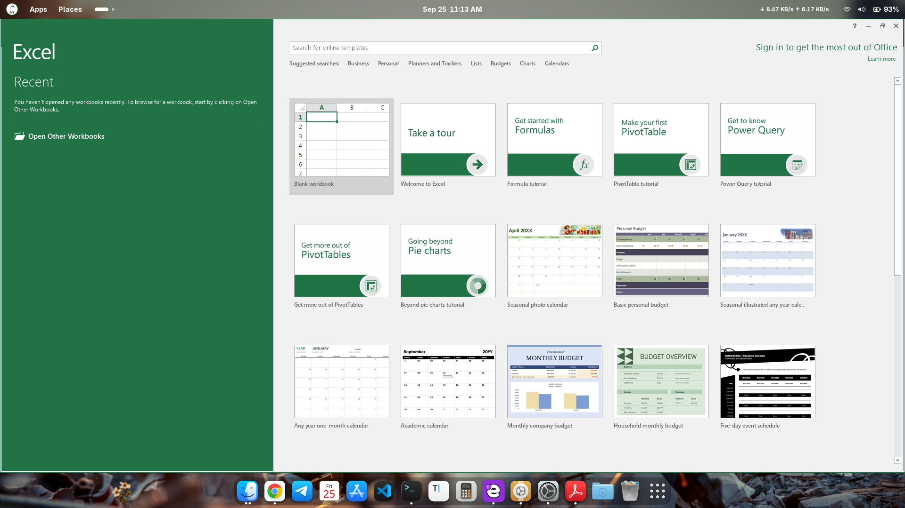

# Office 2016 + WineCX — Fedora 44

Automatic installer for running **Microsoft Office 2016 32-bit** on Fedora using **WineCX** and a dedicated `~/.office2016` prefix.

> **Status:** V3.13.4  
> This version focuses on resumable installation, concise installer output, percentage progress, font permission fixes, icon installation, GNOME launchers, and final verification.

---

## ⚠️ Important Notes

This project **does not include the Microsoft Office ISO, WineCX binary, font packages, or other proprietary Microsoft files**.

Users must provide files they are legally entitled to use/distribute and place them in `~/Downloads`.

If source files are provided through Google Drive, use **your own Google Drive link** in the source table below.

---

## 1. Requirements

### System

- Fedora Linux 44 (Forty Four)
- x86_64 architecture
- Internet connection for Fedora dependencies / Winetricks
- `sudo` access
- Sufficient storage for Office and the Wine prefix

### Required Files

Place all required files in:

```text
~/Downloads/
```

| File | Description | Link |
|---|---|---|
| `install_office2016_fedora.py` | Main installer | This repository |
| `SW_DVD5_Office_Professional_Plus_2016_W32_English_MLF_X20-41353.ISO` | Office 2016 32-bit ISO | [📁 Google Drive](https://drive.google.com/drive/folders/1AnTp0PMuoUi1mC-LkcSHQFRXriFY54i5?usp=sharing) |
| `winecx.zip` | Precompiled WineCX | [📁 Google Drive](https://drive.google.com/drive/folders/1AnTp0PMuoUi1mC-LkcSHQFRXriFY54i5?usp=sharing) |
| `FuentesOffice365.zip` | Fonts used by the installer | [📁 Google Drive](https://drive.google.com/drive/folders/1AnTp0PMuoUi1mC-LkcSHQFRXriFY54i5?usp=sharing) |
| `Requerimientos Office 2016.zip` | DLLs, icons, and supporting files | [📁 Google Drive](https://drive.google.com/drive/folders/1AnTp0PMuoUi1mC-LkcSHQFRXriFY54i5?usp=sharing) |

> File names must match the names listed in the table so the installer can find them automatically.

### 📁 Source Files

All source files are available in one Google Drive folder:

**[📁 Download Office 2016 + WineCX — Google Drive](https://drive.google.com/drive/folders/1AnTp0PMuoUi1mC-LkcSHQFRXriFY54i5?usp=sharing)**

Download the required files from the folder and place them in `~/Downloads`.

---

## 2. File Structure

After all files are placed in `~/Downloads`, the initial structure should look approximately like this:

```text
~/Downloads/
├── install_office2016_fedora.py
├── SW_DVD5_Office_Professional_Plus_2016_W32_English_MLF_X20-41353.ISO
├── winecx.zip
├── FuentesOffice365.zip
└── Requerimientos Office 2016.zip
```

The installer handles extraction of the supporting files.

For `Requerimientos Office 2016.zip`, the source structure used is:

```text
Requerimientos Office 2016.zip
└── Requerimientos Office 2016/
    └── Office 2016 icons.zip
        └── Office 2016 icons/
            ├── word2016.png
            ├── excel2016.png
            ├── powerpoint2016.png
            ├── outlook2016.png
            ├── access2016.png
            └── publisher2016.png
```

---

# 3. Installation

## Step 1 — Clone the Repository

Clone the repository:

```bash
git clone https://github.com/denitrisna7/office2016-winecx-fedora.git
cd office2016-winecx-fedora
```

Copy the installer to Downloads:

```bash
cp install_office2016_fedora.py ~/Downloads/
```

---

## Step 2 — Verify the Source Files

Check:

```bash
cd ~/Downloads

ls -lh "SW_DVD5_Office_Professional_Plus_2016_W32_English_MLF_X20-41353.ISO" "winecx.zip" "FuentesOffice365.zip" "Requerimientos Office 2016.zip"
```

If all four files are listed, continue.

---

## Step 3 — Run the Installer

```bash
cd ~/Downloads
chmod +x install_office2016_fedora.py
python3 install_office2016_fedora.py
```

The installer may request your `sudo` password when required.

---

## 3.1 Tested Environment

This installer was developed and tested in the following environment:

| Component | Version / Detail |
|---|---|
| Operating System | **Fedora Linux 44 (Forty Four)** |
| Architecture | **x86_64** |
| Desktop Environment | **GNOME 50.2** |
| Wine | **WineCX** |
| WineCX location | `/opt/winecx` |
| Office prefix | `~/.office2016` |
| Microsoft Office | **Office 2016 32-bit** |

> **Test environment:** Fedora Linux 44 (Forty Four), x86_64, GNOME 50.2.

---

## 3.2 Screenshots

### Fedora Desktop

The Fedora desktop used during development and testing:



### Hardware Information

Hardware and system information from the test machine:



### GNOME All Apps — Office Applications

Microsoft Office applications available in the GNOME Applications menu:





### Microsoft PowerPoint 2016

PowerPoint 2016 running through WineCX:



### Microsoft Word 2016

Word 2016 running through WineCX:



### Microsoft Excel 2016

Excel 2016 running through WineCX:



---

# 4. What Does the Installer Do?

The installer runs the following stages:

```text
[  8%] Source files ready
[ 15%] Installing Fedora dependencies
[ 23%] Preparing WineCX
[ 31%] Preparing Office prefix
[ 38%] Installing Winetricks components
[ 46%] Checking Office 2016 installation
[ 54%] Installing Gecko / Mono
[ 62%] Applying DirectX fixes
[ 69%] Applying Office DLLs
[ 77%] Installing Office icons
[ 85%] Installing fonts
[ 92%] Creating Office launchers
[100%] Final verification
```

Normal subprocess output is kept concise so the terminal is not flooded with logs.

If an error occurs, detailed error output is displayed.

---

# 5. What If Office Is Already Installed?

The installer can detect an existing Office installation.

If the prefix already contains Office 2016:

```text
State: COMPLETE

[ OK ] Office 2016 is already installed/present.
[INFO] Skipping setup.exe only; continuing all remaining PDF stages.
```

This means the installer **does not reinstall Office**.

The remaining stages are still executed, including:

- Gecko / Mono
- DirectX fixes
- Office DLLs
- Icons
- Fonts
- Launchers
- Excel associations
- Desktop database update
- Final verification

This allows the script to **repair or complete an installation that previously stopped partway through the process**.

---

# 6. Wine Prefix

Office uses the following prefix:

```text
~/.office2016
```

The Wine executable used by the launchers is:

```text
/opt/winecx/bin/wine
```

Wine server:

```text
/opt/winecx/bin/wineserver
```

WineCX:

```text
/opt/winecx
```

The installer does not remove an existing prefix.

---

# 7. Office Launchers

The installer creates GNOME launchers for:

- Microsoft Word 2016
- Microsoft Excel 2016
- Microsoft PowerPoint 2016
- Microsoft Outlook 2016
- Microsoft Access 2016
- Microsoft Publisher 2016

Launchers are stored in:

```text
/usr/share/applications/
```

Icons are stored in:

```text
/usr/share/icons/hicolor/256x256/apps/
```

Example icons:

```text
word2016.png
excel2016.png
powerpoint2016.png
outlook2016.png
access2016.png
publisher2016.png
```

---

# 8. Fonts

Fonts from:

```text
FuentesOffice365.zip
```

are installed into the Wine prefix:

```text
~/.office2016/drive_c/windows/Fonts/
```

The installer also handles cases where fonts from a previous installation have ownership or permissions that cause errors such as:

```text
Permission denied:
~/.office2016/drive_c/windows/Fonts/tahoma.ttf
```

Permissions are repaired only within the Fonts directory of the Office prefix.

---

# 9. Verification After Installation

Run:

```bash
ls -lh /usr/share/icons/hicolor/256x256/apps/*2016*.png
```

The following six icons should exist:

```text
word2016.png
excel2016.png
powerpoint2016.png
outlook2016.png
access2016.png
publisher2016.png
```

Check the launchers:

```bash
ls -lh /usr/share/applications/*2016.desktop
```

---

# 10. Running Office

After installation, open **Applications / Show Apps** in GNOME and look for:

```text
Microsoft Word 2016
Microsoft Excel 2016
Microsoft PowerPoint 2016
```

The launchers use WineCX directly.

---

# 11. If Icons Do Not Appear

Refresh the icon and desktop caches:

```bash
sudo gtk-update-icon-cache -f -t /usr/share/icons/hicolor
sudo update-desktop-database /usr/share/applications
```

Then log out and log back into GNOME.

If the icons still do not appear, check:

```bash
ls -lh /usr/share/icons/hicolor/256x256/apps/*2016*.png
grep -R "^Icon=" /usr/share/applications/*2016.desktop
```

---

# 12. Installation Log

The installer creates a log at:

```text
~/Downloads/office2016_v3_13_4.log
```

If the installation encounters a problem, provide the contents of this log for diagnosis.

---

# 13. Restarting the Installation

The installer **is not designed to automatically remove everything**.

This is intentional so that:

- WineCX does not need to be downloaded again
- The Office prefix is preserved
- Office does not need to be reinstalled
- Source files remain available
- A successful installation is not damaged

If you want a clean installation, remove the prefix only after understanding the consequences:

```bash
rm -rf ~/.office2016
```

> Do not run this command if you only want to repair launchers, icons, fonts, or post-installation stages.

---

# 14. Troubleshooting

### `setup.exe not found`

Make sure the ISO exists with the correct name:

```text
SW_DVD5_Office_Professional_Plus_2016_W32_English_MLF_X20-41353.ISO
```

### `winecx.zip` not found

Make sure:

```text
~/Downloads/winecx.zip
```

exists.

### Icons not found

Make sure:

```text
~/Downloads/Requerimientos Office 2016.zip
```

exists.

The installer will look for:

```text
Requerimientos Office 2016/Office 2016 icons.zip
```

and extract it when necessary.

### Permission denied on fonts

V3.13.4 handles ownership and permission problems with fonts left by previous installations.

### Office detected as COMPLETE

This is normal.

The installer skips `setup.exe` and continues with the post-installation stages.

---

# 15. License and Distribution

This repository contains **only the installation script**.

Microsoft Office files, the ISO, proprietary fonts, proprietary DLLs, and other copyrighted materials **are not included in this repository**.

Users are responsible for ensuring that they have the necessary rights and licenses to obtain and use those files.

If you provide source files through Google Drive, use files that you are legally entitled to share and configure Google Drive permissions appropriately.

---

# 16. Contributing

Pull requests and issues are welcome for:

- Fedora compatibility improvements
- Installer fixes
- Launcher fixes
- Icon fixes
- Documentation improvements
- Better error handling

---

## License

The license for this repository can be determined by the repository owner.

> **Note:** The license for this installation script does not grant any rights to Microsoft Office or any proprietary Microsoft components.
